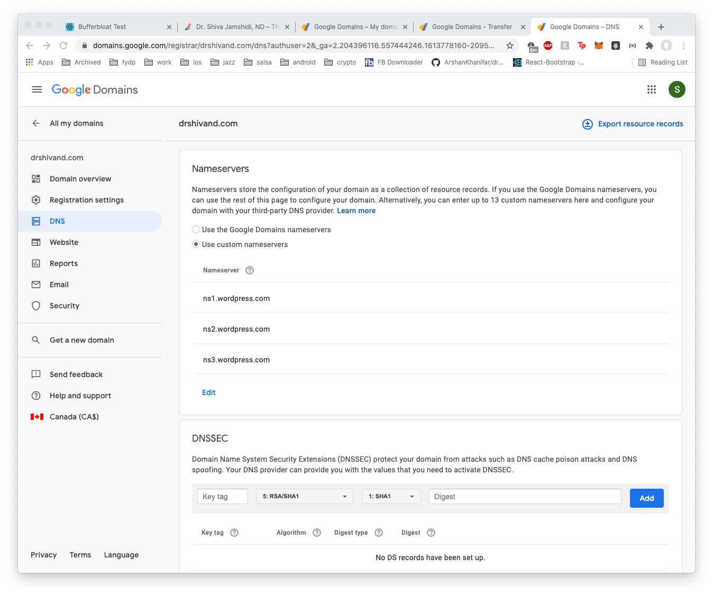
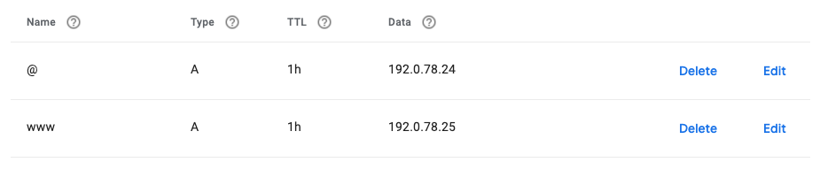

## Setting Up DNS Records for a Website

### March 16 2021
I was making a [website](https://drshivand.com/) for my mom's business:
* Website is hosted on Wordpress.com
* Domain is on Google Domains

*Nameserver Fix*: I went to [domains.google.com](https://domains.google.com), and from the left nav 
selected `DNS`, then in the first pane *Name Servers* I selected `Use custom name servers` and entered 
Wordpress' name server addresses: 
```
ns1.wordpress.com
ns2.wordpress.com
ns3.wordpress.com
```
This is what it looked like:
.

*A record fix*:
The nameserver fix is actually easier, but I wanted to try this too just to make sure I understand it.
In the same [domains.google.com](https://domains.google.com) page I basically scrolled down to 
`Custom Resource Records` section and added two new A records that pointed to these ip addresses:
```
192.0.78.24
192.0.78.25
```
And this is what the rows looked like. 
.

#### Note
Wordpress told me to add both ip addresses, but it didn't really specify what `Name` I should put for them,
so I was kinda confused and tried putting @ for both of them, but Google Domains didn't let me. So I used `@`
for one and `www` for the other one, and it worked. I still don't fully know which one is getting used behind 
the scenes though.  

